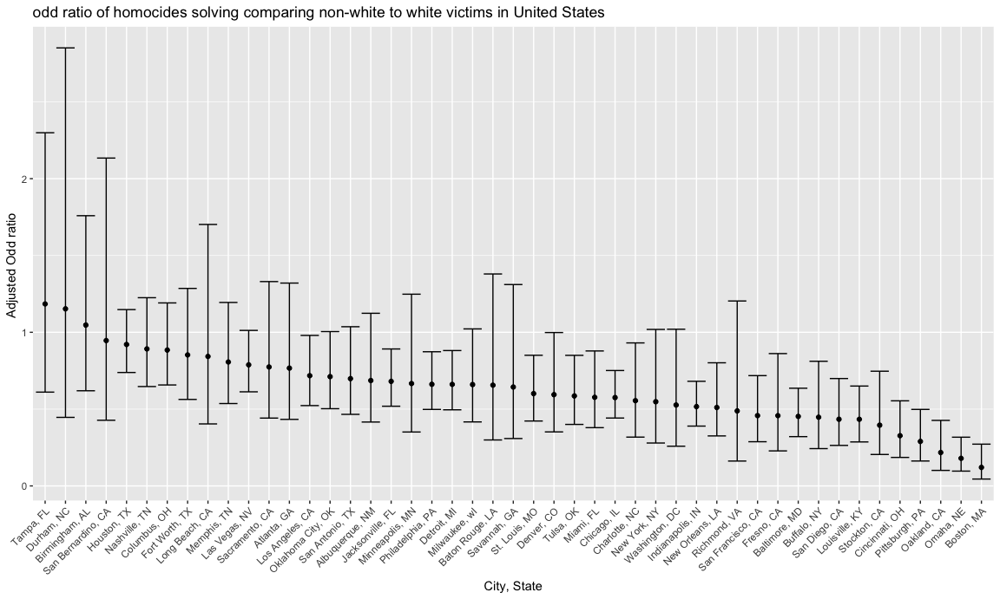
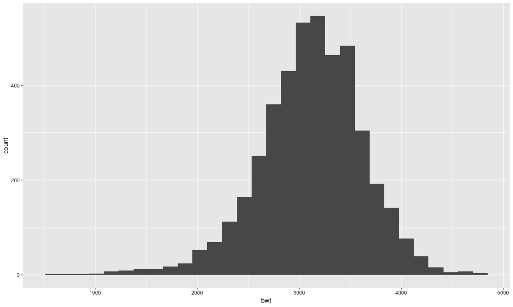
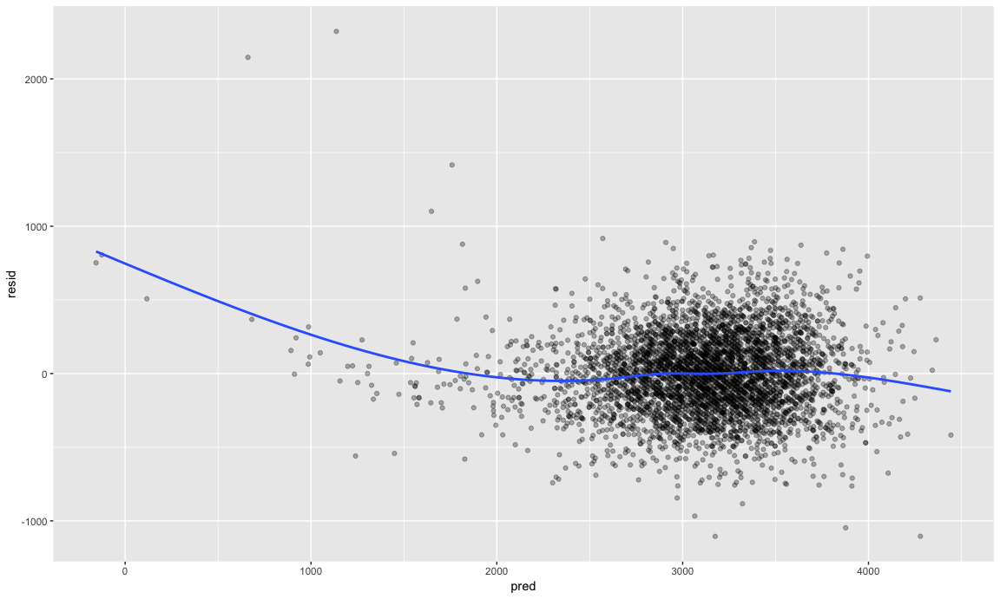
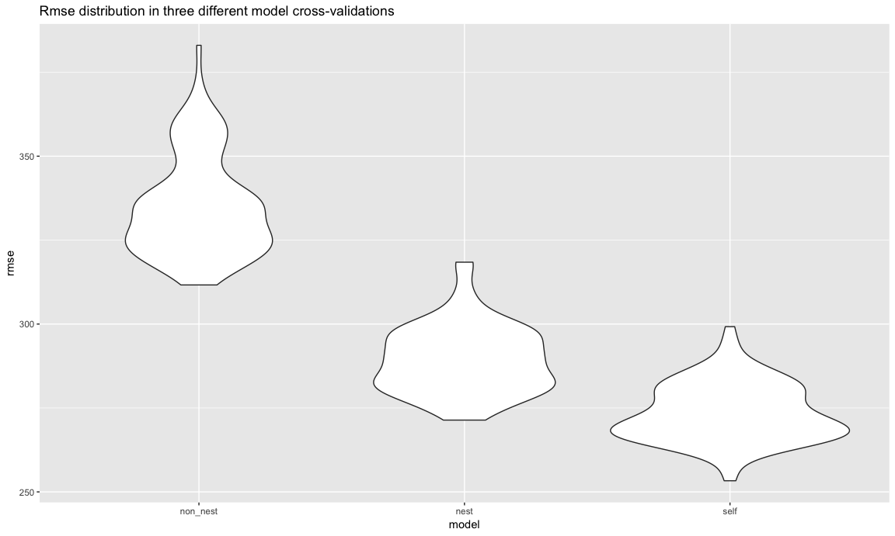

Homework6
================
Xinyao Wu
2018/11/16

``` r
knitr::opts_chunk$set(
  fig.width = 12,
  fig.asp = .6,
  out.width = "100%"
)
```

problem1
--------

**Washington Post**

##### (1) Tidy Data

*disposition: new binary variable*

*delete records:Dallas, TX; Phoenix, AZ; and Kansas City, MO*

*exhibit head 5 lines of dataset*

``` r
Original_data = read.csv("https://raw.githubusercontent.com/washingtonpost/data-homicides/master/homicide-data.csv") 
wp_df = 
  Original_data %>% 
  janitor::clean_names() %>% 
  #Create a city_state variable and a binary variable indicating whether the homicide is solved.
  mutate(
    city_state = str_c(city,state, sep = ", "), 
    resolved = as.numeric(disposition == "Closed by arrest")
  ) %>% 
  #Omit cities Dallas, TX; Phoenix, AZ; and Kansas City, MO
  filter(
    city_state != "Dallas, TX" & city_state !="Phoenix, AZ" & city_state !="Kansas City, MO" & city_state !="Tulsa, AL"
  ) %>% 
  mutate(
    victim_race = ifelse(victim_race =="White","white","non_white"),
    victim_race = fct_relevel(victim_race, "white"),
    victim_age = as.numeric(victim_age)
  )
wp_df %>% head(5) 
```

    ##          uid reported_date victim_last victim_first victim_race victim_age
    ## 1 Alb-000001      20100504      GARCIA         JUAN   non_white         79
    ## 2 Alb-000002      20100216     MONTOYA      CAMERON   non_white         12
    ## 3 Alb-000003      20100601 SATTERFIELD      VIVIANA       white         10
    ## 4 Alb-000004      20100101    MENDIOLA       CARLOS   non_white         29
    ## 5 Alb-000005      20100102        MULA       VIVIAN       white         73
    ##   victim_sex        city state      lat       lon           disposition
    ## 1       Male Albuquerque    NM 35.09579 -106.5386 Closed without arrest
    ## 2       Male Albuquerque    NM 35.05681 -106.7153      Closed by arrest
    ## 3     Female Albuquerque    NM 35.08609 -106.6956 Closed without arrest
    ## 4       Male Albuquerque    NM 35.07849 -106.5561      Closed by arrest
    ## 5     Female Albuquerque    NM 35.13036 -106.5810 Closed without arrest
    ##        city_state resolved
    ## 1 Albuquerque, NM        0
    ## 2 Albuquerque, NM        1
    ## 3 Albuquerque, NM        0
    ## 4 Albuquerque, NM        1
    ## 5 Albuquerque, NM        0

##### (2)Fit a logistic regression for "Baltimore, MD"

``` r
#For the city of Baltimore, MD
baltimore = wp_df %>% 
  filter(city_state =="Baltimore, MD") 
#fit a logistic regression
fit_baltimore = glm(resolved ~ victim_age + victim_sex + victim_race , family = binomial(), data = baltimore)

broom::tidy(fit_baltimore)
## # A tibble: 4 x 5
##   term                 estimate std.error statistic  p.value
##   <chr>                   <dbl>     <dbl>     <dbl>    <dbl>
## 1 (Intercept)           1.05      0.227        4.62 3.78e- 6
## 2 victim_age           -0.00374   0.00303     -1.23 2.17e- 1
## 3 victim_sexMale       -0.885     0.136       -6.50 8.08e-11
## 4 victim_racenon_white -0.793     0.174       -4.55 5.33e- 6
#the estimate of the adjusted odds ratio for solving homicides comparing non-white victims to white victims
coef(fit_baltimore)["victim_racenon_white"] %>% exp()
## victim_racenon_white 
##            0.4525206
#the confidence interval of the adjusted odds ratio for solving homicides comparing non-white victims to white victims
confint(fit_baltimore,"victim_racenon_white")%>% exp()
## Waiting for profiling to be done...
##     2.5 %    97.5 % 
## 0.3208675 0.6359593
```

The estimate of the adjusted odds ratio for solving homicides comparing non-white victims to white victims is 0.453, and the 95% CI is (0.321,0.636).

##### (3)Glm for each of the cities and extract the adjusted odds ratio (and CI)

``` r
 city_glm =
  wp_df %>% 
  select(resolved, city_state, victim_race,victim_age,victim_sex) %>% 
  group_by(city_state) %>% 
  nest() %>% 
  mutate(
    model = map(data,~glm(resolved ~ victim_age + victim_sex + victim_race ,family = binomial(),data = .)),
    model = map(model, ~broom::tidy(.,conf.int = TRUE))
)  %>% 
   select(-data) %>% 
  unnest() %>% 
  filter(term == "victim_racenon_white")  %>% 
  mutate(OR = exp(estimate),
         CI.low = exp(conf.low),
         CI.high = exp(conf.high)) %>% 
  select(city_state,OR,CI.low ,CI.high ) 

 knitr::kable(city_glm)
```

| city\_state        |         OR|     CI.low|    CI.high|
|:-------------------|----------:|----------:|----------:|
| Albuquerque, NM    |  0.6860531|  0.4158651|  1.1237789|
| Atlanta, GA        |  0.7667500|  0.4332108|  1.3204368|
| Baltimore, MD      |  0.4525206|  0.3208675|  0.6359593|
| Baton Rouge, LA    |  0.6558545|  0.2991473|  1.3796610|
| Birmingham, AL     |  1.0471153|  0.6194345|  1.7589481|
| Boston, MA         |  0.1205147|  0.0447382|  0.2718771|
| Buffalo, NY        |  0.4474175|  0.2428559|  0.8114462|
| Charlotte, NC      |  0.5550724|  0.3176813|  0.9308972|
| Chicago, IL        |  0.5751690|  0.4418968|  0.7512545|
| Cincinnati, OH     |  0.3269424|  0.1855044|  0.5539299|
| Columbus, OH       |  0.8844860|  0.6571620|  1.1912101|
| Denver, CO         |  0.5942632|  0.3516149|  0.9984268|
| Detroit, MI        |  0.6609813|  0.4954501|  0.8811824|
| Durham, NC         |  1.1528002|  0.4461779|  2.8513251|
| Fort Worth, TX     |  0.8527376|  0.5630263|  1.2856761|
| Fresno, CA         |  0.4574375|  0.2279975|  0.8614185|
| Houston, TX        |  0.9207334|  0.7383821|  1.1478080|
| Indianapolis, IN   |  0.5162217|  0.3894364|  0.6810646|
| Jacksonville, FL   |  0.6805895|  0.5188224|  0.8914835|
| Las Vegas, NV      |  0.7883387|  0.6125905|  1.0123323|
| Long Beach, CA     |  0.8428440|  0.4036730|  1.7021042|
| Los Angeles, CA    |  0.7176698|  0.5229269|  0.9797933|
| Louisville, KY     |  0.4336608|  0.2863436|  0.6500960|
| Memphis, TN        |  0.8066744|  0.5362340|  1.1942958|
| Miami, FL          |  0.5768849|  0.3792302|  0.8785443|
| Milwaukee, wI      |  0.6598363|  0.4166015|  1.0220458|
| Minneapolis, MN    |  0.6665973|  0.3509751|  1.2480053|
| Nashville, TN      |  0.8919720|  0.6469603|  1.2251676|
| New Orleans, LA    |  0.5105893|  0.3254921|  0.8014908|
| New York, NY       |  0.5481259|  0.2793238|  1.0187471|
| Oakland, CA        |  0.2174194|  0.1010541|  0.4265683|
| Oklahoma City, OK  |  0.7114617|  0.5026591|  1.0045578|
| Omaha, NE          |  0.1795682|  0.0964159|  0.3171570|
| Philadelphia, PA   |  0.6615811|  0.4979879|  0.8733839|
| Pittsburgh, PA     |  0.2896680|  0.1621670|  0.4981128|
| Richmond, VA       |  0.4882646|  0.1619032|  1.2038615|
| San Antonio, TX    |  0.6983376|  0.4658904|  1.0362874|
| Sacramento, CA     |  0.7743855|  0.4415561|  1.3301655|
| Savannah, GA       |  0.6437600|  0.3084459|  1.3108709|
| San Bernardino, CA |  0.9462056|  0.4274584|  2.1341564|
| San Diego, CA      |  0.4339041|  0.2637610|  0.6990111|
| San Francisco, CA  |  0.4577118|  0.2876816|  0.7179243|
| St. Louis, MO      |  0.6010156|  0.4225284|  0.8504212|
| Stockton, CA       |  0.3954507|  0.2047117|  0.7467064|
| Tampa, FL          |  1.1845998|  0.6105905|  2.2990952|
| Tulsa, OK          |  0.5857297|  0.4003695|  0.8499751|
| Washington, DC     |  0.5268148|  0.2583887|  1.0199716|

##### (5)Create a plot that shows the estimated ORs and CIs for each city. Organize cities according to estimated OR, and comment on the plot.

``` r
city_glm %>% 
  mutate(
    city_state = reorder(city_state,desc(OR))
  ) %>% 
ggplot(aes(x = city_state, y = OR))+ geom_line()+
  geom_point()+
  geom_errorbar(aes(x= city_state,ymin = CI.low, ymax = CI.high))+
  labs(
    x = "City, State",
    y = "Adjusted Odd ratio ",
    title = "odd ratio of homocides solving comparing non-white to white victims in United States"
  )+
  theme(
    axis.text.x = element_text(angle = 45 , hjust = 1)
  )
```

    ## geom_path: Each group consists of only one observation. Do you need to
    ## adjust the group aesthetic?



Comment:
--------

Most cities who have a higher OR are tending to have a wider OR confidence interval.`Tampa,Fl`,`Durham,NC`,`Birmingham,AL` these three cities have a OR higher than 1, which indicates in these cities, homicides with non-white victims are more likely to be solved. However, since they all have a wide 95% confidence interval, which include point 1, there still exists some probability that homicides with non-white victims are equal or less likely to be solved.

problem2
--------

#### (1)Load and clean the data for regression analysis

``` r
orignal_bw = read.csv("./data/birthweight.csv")
bw_df = orignal_bw %>% 
  janitor::clean_names() %>% 
  #convert numeric to factor where appropriate
  mutate(
    babysex = as.factor(ifelse(babysex==1,"male","female")),
    frace = as.factor(frace),
    malform = as.factor(malform),
    mrace = as.factor(mrace)
  )
#check for missing data
table(is.na(bw_df))
```

    ## 
    ## FALSE 
    ## 86840

#### (2)Propose a regression model for birthweight.

This model may be based on a hypothesized structure for the factors that underly birthweight, on a data-driven model-building process, or a combination of the two. **Describe your modeling process** and show a plot of model residuals against fitted values – use add\_predictions and add\_residuals in making this plot.

**1)check the distribution of `bwt`**

``` r
bw_df %>% 
#the distribution of baby’s birth weight
ggplot(aes(x = bwt))+geom_histogram()
```

    ## `stat_bin()` using `bins = 30`. Pick better value with `binwidth`.



``` r
#likely normal
```

**2)choose predictors**

Although there are variables,such as `blength`,`bhead`,`baby sex` and so on, that cannot be seen as logic predictors for birthweight since they are all outcomes as birthweight, to more specificly know the p-value of all the variables, we make a total linear regression first.

``` r
choose_predi = lm(bwt~.,data = bw_df)
broom::tidy(choose_predi) %>% 
  select(term,p.value) %>% 
 arrange(p.value) 
```

    ## # A tibble: 22 x 2
    ##    term          p.value
    ##    <chr>           <dbl>
    ##  1 bhead       2.16e-271
    ##  2 blength     1.75e-261
    ##  3 delwt       5.62e- 25
    ##  4 (Intercept) 5.56e- 21
    ##  5 smoken      1.78e- 16
    ##  6 gaweeks     4.06e- 15
    ##  7 babysexmale 7.02e-  4
    ##  8 mrace2      1.01e-  3
    ##  9 parity      1.83e-  2
    ## 10 fincome     1.07e-  1
    ## # ... with 12 more rows

The three lowest p-value owner are `bhead`,`blength`,`delwt`.However, obviously they are not factors that can underly birthweight except `delwt`. Sometimes we keep such variables to adjust the coefficient value for other variables so we are not sure whether to delet such variables from modeling or not. Thus, I will make a new model mainly based on data-driven model-building process.

``` r
lm(bwt ~ ., data = bw_df) %>% 
  step(direction='both')
```

    ## Start:  AIC=48717.83
    ## bwt ~ babysex + bhead + blength + delwt + fincome + frace + gaweeks + 
    ##     malform + menarche + mheight + momage + mrace + parity + 
    ##     pnumlbw + pnumsga + ppbmi + ppwt + smoken + wtgain
    ## 
    ## 
    ## Step:  AIC=48717.83
    ## bwt ~ babysex + bhead + blength + delwt + fincome + frace + gaweeks + 
    ##     malform + menarche + mheight + momage + mrace + parity + 
    ##     pnumlbw + pnumsga + ppbmi + ppwt + smoken
    ## 
    ## 
    ## Step:  AIC=48717.83
    ## bwt ~ babysex + bhead + blength + delwt + fincome + frace + gaweeks + 
    ##     malform + menarche + mheight + momage + mrace + parity + 
    ##     pnumlbw + ppbmi + ppwt + smoken
    ## 
    ## 
    ## Step:  AIC=48717.83
    ## bwt ~ babysex + bhead + blength + delwt + fincome + frace + gaweeks + 
    ##     malform + menarche + mheight + momage + mrace + parity + 
    ##     ppbmi + ppwt + smoken
    ## 
    ##            Df Sum of Sq       RSS   AIC
    ## - frace     4    124365 320848704 48712
    ## - malform   1      1419 320725757 48716
    ## - ppbmi     1      6346 320730684 48716
    ## - momage    1     28661 320752999 48716
    ## - mheight   1     66886 320791224 48717
    ## - menarche  1    111679 320836018 48717
    ## - ppwt      1    131132 320855470 48718
    ## <none>                  320724338 48718
    ## - fincome   1    193454 320917792 48718
    ## - parity    1    413584 321137922 48721
    ## - mrace     3    868321 321592659 48724
    ## - babysex   1    853796 321578134 48727
    ## - gaweeks   1   4611823 325336161 48778
    ## - smoken    1   5076393 325800732 48784
    ## - delwt     1   8008891 328733230 48823
    ## - blength   1 102050296 422774634 49915
    ## - bhead     1 106535716 427260054 49961
    ## 
    ## Step:  AIC=48711.51
    ## bwt ~ babysex + bhead + blength + delwt + fincome + gaweeks + 
    ##     malform + menarche + mheight + momage + mrace + parity + 
    ##     ppbmi + ppwt + smoken
    ## 
    ##            Df Sum of Sq       RSS   AIC
    ## - malform   1      1447 320850151 48710
    ## - ppbmi     1      6975 320855679 48710
    ## - momage    1     28379 320877083 48710
    ## - mheight   1     69502 320918206 48710
    ## - menarche  1    115708 320964411 48711
    ## - ppwt      1    133961 320982665 48711
    ## <none>                  320848704 48712
    ## - fincome   1    194405 321043108 48712
    ## - parity    1    414687 321263390 48715
    ## + frace     4    124365 320724338 48718
    ## - babysex   1    852133 321700837 48721
    ## - gaweeks   1   4625208 325473911 48772
    ## - smoken    1   5036389 325885093 48777
    ## - delwt     1   8013099 328861802 48817
    ## - mrace     3  13540415 334389119 48885
    ## - blength   1 101995688 422844392 49908
    ## - bhead     1 106662962 427511666 49956
    ## 
    ## Step:  AIC=48709.53
    ## bwt ~ babysex + bhead + blength + delwt + fincome + gaweeks + 
    ##     menarche + mheight + momage + mrace + parity + ppbmi + ppwt + 
    ##     smoken
    ## 
    ##            Df Sum of Sq       RSS   AIC
    ## - ppbmi     1      6928 320857079 48708
    ## - momage    1     28660 320878811 48708
    ## - mheight   1     69320 320919470 48708
    ## - menarche  1    116027 320966177 48709
    ## - ppwt      1    133894 320984044 48709
    ## <none>                  320850151 48710
    ## - fincome   1    193784 321043934 48710
    ## + malform   1      1447 320848704 48712
    ## - parity    1    414482 321264633 48713
    ## + frace     4    124393 320725757 48716
    ## - babysex   1    851279 321701430 48719
    ## - gaweeks   1   4624003 325474154 48770
    ## - smoken    1   5035195 325885346 48775
    ## - delwt     1   8029079 328879230 48815
    ## - mrace     3  13553320 334403471 48883
    ## - blength   1 102009225 422859375 49906
    ## - bhead     1 106675331 427525481 49954
    ## 
    ## Step:  AIC=48707.63
    ## bwt ~ babysex + bhead + blength + delwt + fincome + gaweeks + 
    ##     menarche + mheight + momage + mrace + parity + ppwt + smoken
    ## 
    ##            Df Sum of Sq       RSS   AIC
    ## - momage    1     29211 320886290 48706
    ## - menarche  1    117635 320974714 48707
    ## <none>                  320857079 48708
    ## - fincome   1    195199 321052278 48708
    ## + ppbmi     1      6928 320850151 48710
    ## + malform   1      1400 320855679 48710
    ## - parity    1    412984 321270064 48711
    ## + frace     4    125020 320732060 48714
    ## - babysex   1    850020 321707099 48717
    ## - mheight   1   1078673 321935752 48720
    ## - ppwt      1   2934023 323791103 48745
    ## - gaweeks   1   4621504 325478583 48768
    ## - smoken    1   5039368 325896447 48773
    ## - delwt     1   8024939 328882018 48813
    ## - mrace     3  13551444 334408523 48881
    ## - blength   1 102018559 422875638 49904
    ## - bhead     1 106821342 427678421 49953
    ## 
    ## Step:  AIC=48706.02
    ## bwt ~ babysex + bhead + blength + delwt + fincome + gaweeks + 
    ##     menarche + mheight + mrace + parity + ppwt + smoken
    ## 
    ##            Df Sum of Sq       RSS   AIC
    ## - menarche  1    100121 320986412 48705
    ## <none>                  320886290 48706
    ## - fincome   1    240800 321127090 48707
    ## + momage    1     29211 320857079 48708
    ## + ppbmi     1      7479 320878811 48708
    ## + malform   1      1678 320884612 48708
    ## - parity    1    431433 321317724 48710
    ## + frace     4    124743 320761547 48712
    ## - babysex   1    841278 321727568 48715
    ## - mheight   1   1076739 321963029 48719
    ## - ppwt      1   2913653 323799943 48743
    ## - gaweeks   1   4676469 325562760 48767
    ## - smoken    1   5045104 325931394 48772
    ## - delwt     1   8000672 328886962 48811
    ## - mrace     3  14667730 335554021 48894
    ## - blength   1 101990556 422876847 49902
    ## - bhead     1 106864308 427750598 49952
    ## 
    ## Step:  AIC=48705.38
    ## bwt ~ babysex + bhead + blength + delwt + fincome + gaweeks + 
    ##     mheight + mrace + parity + ppwt + smoken
    ## 
    ##            Df Sum of Sq       RSS   AIC
    ## <none>                  320986412 48705
    ## + menarche  1    100121 320886290 48706
    ## - fincome   1    245637 321232048 48707
    ## + momage    1     11698 320974714 48707
    ## + ppbmi     1      8823 320977589 48707
    ## + malform   1      1884 320984528 48707
    ## - parity    1    422770 321409181 48709
    ## + frace     4    128726 320857686 48712
    ## - babysex   1    846134 321832545 48715
    ## - mheight   1   1012240 321998651 48717
    ## - ppwt      1   2907049 323893461 48743
    ## - gaweeks   1   4662501 325648912 48766
    ## - smoken    1   5073849 326060260 48771
    ## - delwt     1   8137459 329123871 48812
    ## - mrace     3  14683609 335670021 48894
    ## - blength   1 102191779 423178191 49903
    ## - bhead     1 106779754 427766166 49950

    ## 
    ## Call:
    ## lm(formula = bwt ~ babysex + bhead + blength + delwt + fincome + 
    ##     gaweeks + mheight + mrace + parity + ppwt + smoken, data = bw_df)
    ## 
    ## Coefficients:
    ## (Intercept)  babysexmale        bhead      blength        delwt  
    ##   -6070.264      -28.558      130.777       74.947        4.107  
    ##     fincome      gaweeks      mheight       mrace2       mrace3  
    ##       0.318       11.592        6.594     -138.792      -74.887  
    ##      mrace4       parity         ppwt       smoken  
    ##    -100.678       96.305       -2.676       -4.843

To aviod overfit, we only choose 6 factors as our model\`s predictors.

``` r
fit_test1 = lm(bwt ~ babysex + bhead + blength + delwt + fincome + gaweeks + mheight + mrace + parity + ppwt + smoken, data = bw_df)
broom::tidy(fit_test1) %>% arrange(p.value)
```

    ## # A tibble: 14 x 5
    ##    term         estimate std.error statistic   p.value
    ##    <chr>           <dbl>     <dbl>     <dbl>     <dbl>
    ##  1 (Intercept) -6070.      137.       -44.3  0.       
    ##  2 bhead         131.        3.45      37.9  3.10e-272
    ##  3 blength        74.9       2.02      37.1  4.29e-262
    ##  4 mrace2       -139.        9.91     -14.0  1.21e- 43
    ##  5 delwt           4.11      0.392     10.5  2.26e- 25
    ##  6 smoken         -4.84      0.586     -8.27 1.75e- 16
    ##  7 gaweeks        11.6       1.46       7.93 2.79e- 15
    ##  8 ppwt           -2.68      0.427     -6.26 4.20e- 10
    ##  9 mrace4       -101.       19.3       -5.21 1.98e-  7
    ## 10 mheight         6.59      1.78       3.69 2.23e-  4
    ## 11 babysexmale   -28.6       8.45      -3.38 7.37e-  4
    ## 12 parity         96.3      40.3        2.39 1.70e-  2
    ## 13 fincome         0.318     0.175      1.82 6.88e-  2
    ## 14 mrace3        -74.9      42.3       -1.77 7.68e-  2

We will choose variables based on the rank of p-value above, that is: `bhead`,`blength`,`mrace`,`delwt`,`smoken`,`gaweeks`. Then we will see how fittable of this model:

``` r
fit_test2 = lm(bwt~bhead+blength+mrace+delwt+smoken+gaweeks,data = bw_df)
broom::glance(fit_test2)
```

    ## # A tibble: 1 x 11
    ##   r.squared adj.r.squared sigma statistic p.value    df  logLik    AIC
    ## *     <dbl>         <dbl> <dbl>     <dbl>   <dbl> <int>   <dbl>  <dbl>
    ## 1     0.714         0.713  274.     1350.       0     9 -30534. 61087.
    ## # ... with 3 more variables: BIC <dbl>, deviance <dbl>, df.residual <int>

The R\_squared is 0.713, which seems it fits well.

**3)Regression model and Plot**

Sincebirthweight is appromately normal distribution, we directly use linear regression.

``` r
#make a linear regression
  fit_self = lm(bwt~bhead+blength+mrace+delwt+smoken+gaweeks,data = bw_df)
  summary(fit_self)
```

    ## 
    ## Call:
    ## lm(formula = bwt ~ bhead + blength + mrace + delwt + smoken + 
    ##     gaweeks, data = bw_df)
    ## 
    ## Residuals:
    ##      Min       1Q   Median       3Q      Max 
    ## -1104.88  -180.75    -3.55   172.57  2322.39 
    ## 
    ## Coefficients:
    ##               Estimate Std. Error t value Pr(>|t|)    
    ## (Intercept) -5752.2622    97.2921 -59.124  < 2e-16 ***
    ## bhead         130.0230     3.4247  37.967  < 2e-16 ***
    ## blength        75.6670     2.0242  37.382  < 2e-16 ***
    ## mrace2       -147.3690     9.2591 -15.916  < 2e-16 ***
    ## mrace3        -74.8522    42.5481  -1.759   0.0786 .  
    ## mrace4       -117.7264    18.7867  -6.266 4.05e-10 ***
    ## delwt           2.2828     0.1964  11.623  < 2e-16 ***
    ## smoken         -4.8472     0.5886  -8.235 2.35e-16 ***
    ## gaweeks        12.3447     1.4571   8.472  < 2e-16 ***
    ## ---
    ## Signif. codes:  0 '***' 0.001 '**' 0.01 '*' 0.05 '.' 0.1 ' ' 1
    ## 
    ## Residual standard error: 274.3 on 4333 degrees of freedom
    ## Multiple R-squared:  0.7137, Adjusted R-squared:  0.7131 
    ## F-statistic:  1350 on 8 and 4333 DF,  p-value: < 2.2e-16

``` r
   reg = bw_df %>% 
     select(bwt,bhead,blength,mrace,delwt, smoken, gaweeks) 
 pred_resid = modelr::add_predictions(reg, fit_self) 
 pred_resid$resid = modelr::add_residuals(reg, fit_self) %>% pull(resid)
 
  ggplot(pred_resid,aes(x = pred, y = resid))+
  geom_point(alpha = 0.3 )+
     geom_smooth(se = FALSE)
```

    ## `geom_smooth()` using method = 'gam' and formula 'y ~ s(x, bs = "cs")'



``` r
    labs(
      title = "predictions vs residuals of the specific linear regression model",
      y = "residual",
      x = "prediction"
    )
```

    ## $title
    ## [1] "predictions vs residuals of the specific linear regression model"
    ## 
    ## $y
    ## [1] "residual"
    ## 
    ## $x
    ## [1] "prediction"
    ## 
    ## attr(,"class")
    ## [1] "labels"

comments
--------

The residuals do not have a desired horizontally symmetric distributed pattern. Espectially when prediction are (0,1000), most residuals seems to have positive value. Meanwhile, 5 points\` residual are beyond 1000 as well as 2 are beyond -1000. However, Most residuals lied between (-1000,+1000). We cannot expect all of the points to have a perfect horizontally symmetric distribution in reality, so this model fits well.

Compare my model to two others:
-------------------------------

**cv set**

``` r
cv_df =
  crossv_mc(bw_df, 100) %>% 
  mutate(train = map(train, as_tibble),
         test = map(test, as_tibble))
```

**plot rmse distribution**

``` r
cv_df = cv_df %>% 
  mutate(
    non_nest_mod = map(train,~lm(bwt~blength + gaweeks,data = .x)),
    nest_mod = map(train,~lm(bwt~bhead * blength * babysex,data = .x)),
    self_mod = map(train,~lm(bwt~bhead+blength+mrace+delwt+smoken+gaweeks,data = bw_df))
  ) %>% 
  mutate(
    rmse_non_nest   = map2_dbl(non_nest_mod, test, ~rmse(model = .x, data = .y)),
    rmse_nest   = map2_dbl(nest_mod, test, ~rmse(model = .x, data = .y)),
    rmse_self   = map2_dbl(self_mod, test, ~rmse(model = .x, data = .y))
  )

cv_df %>% 
  select(starts_with("rmse")) %>% 
  gather(key = "model",value = rmse) %>%
  mutate(
    model = str_replace(model,"rmse_",""),
    model = fct_inorder(model)
         ) %>% 
  ggplot(aes(x = model, y = rmse))+geom_violin()+
  labs(
    title = "Rmse distribution in three different model cross-validations"
  )
```



My model which set `delwt`(mother’s weight at delivery,pounds),`bhead`(baby’s head circumference at birth,centimeters),`blength`(baby’s length at birth,centimeteres) ,`mrace`( mother’s race (1= White, 2 = Black, 3 = Asian, 4 = Puerto Rican, 8 = Other)),`smoken`(average number of cigarettes smoked per day during pregnancy),`gaweeks`(gestational age in weeks) as predictors has a subtle lower rmse than the other two models.

``` r
broom::tidy(fit_self) %>% knitr::kable()
```

| term        |      estimate|   std.error|   statistic|    p.value|
|:------------|-------------:|-----------:|-----------:|----------:|
| (Intercept) |  -5752.262234|  97.2921273|  -59.123615|  0.0000000|
| bhead       |    130.023021|   3.4246632|   37.966659|  0.0000000|
| blength     |     75.667037|   2.0241510|   37.382112|  0.0000000|
| mrace2      |   -147.369033|   9.2591159|  -15.916102|  0.0000000|
| mrace3      |    -74.852248|  42.5481397|   -1.759237|  0.0786079|
| mrace4      |   -117.726395|  18.7866732|   -6.266484|  0.0000000|
| delwt       |      2.282802|   0.1963987|   11.623304|  0.0000000|
| smoken      |     -4.847205|   0.5885954|   -8.235208|  0.0000000|
| gaweeks     |     12.344679|   1.4570691|    8.472267|  0.0000000|

Meanwhile, there are the coefficiences of my model, from which we can see that :(1)compared to white woman, black and Puerto Rican women tend to diliver babies with less wight on the significance of 0.01.(2)when mother’s weight at delivery increases by 1 pounds, we may expect 2.28 grams increasing on babies weight.(3)when mother’s average number of cigarettes smoked per day during pregnancy increases by 1 , we may expect 4.84 grams losting on babies weight.(4)when mother’s gestational age increases by 1 week,we may expect 12.34 grams increasing on babies weight.
