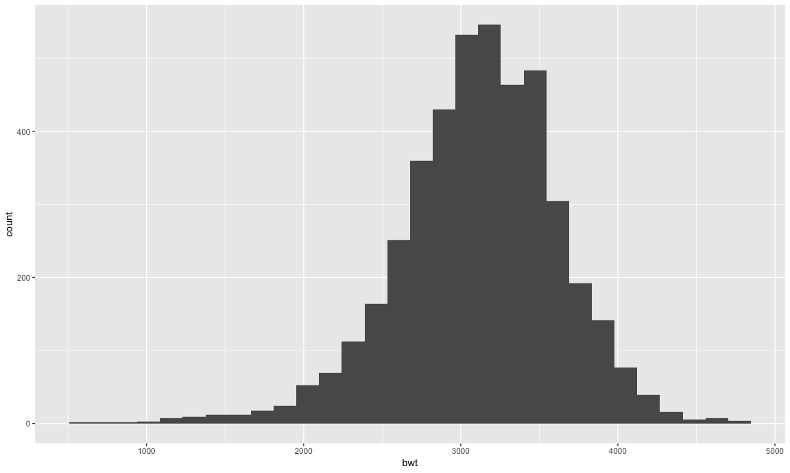
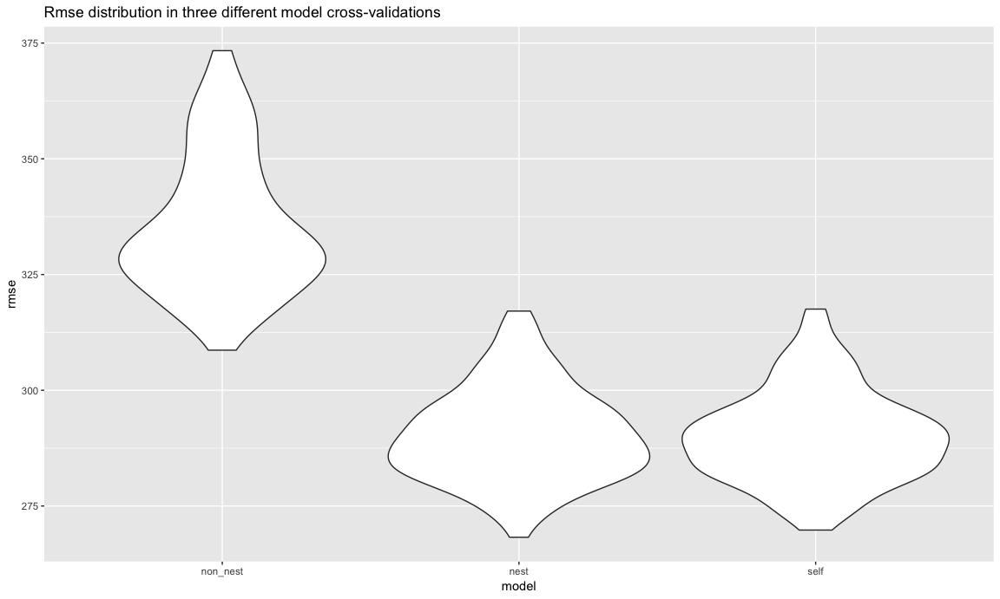
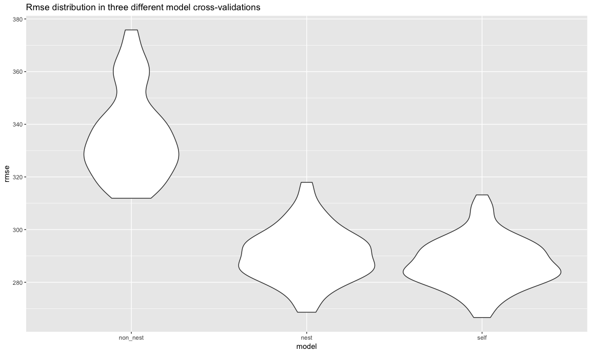

Homework6
================
Xinyao Wu
2018/11/16

``` r
knitr::opts_chunk$set(
  fig.width = 12,
  fig.asp = .6,
  out.width = "100%"
)
```

problem1
--------

**Washington Post**

##### (1) Tidy Data

*disposition: new binary variable*

*delete records:Dallas, TX; Phoenix, AZ; and Kansas City, MO*

*exhibit head 5 lines of dataset*

``` r
Original_data = read.csv("https://raw.githubusercontent.com/washingtonpost/data-homicides/master/homicide-data.csv") 
wp_df = 
  Original_data %>% 
  janitor::clean_names() %>% 
  #Create a city_state variable and a binary variable indicating whether the homicide is solved.
  mutate(
    city_state = str_c(city,state, sep = ", "), 
    resolved = as.numeric(disposition == "Closed by arrest")
  ) %>% 
  #Omit cities Dallas, TX; Phoenix, AZ; and Kansas City, MO
  filter(
    city_state != "Dallas, TX" & city_state !="Phoenix, AZ" & city_state !="Kansas City, MO" & city_state !="Tulsa, AL"
  ) %>% 
  mutate(
    victim_race = ifelse(victim_race =="White","white","non_white"),
    victim_race = fct_relevel(victim_race, "white"),
    victim_age = as.numeric(victim_age)
  )
wp_df %>% head(5) 
```

    ##          uid reported_date victim_last victim_first victim_race victim_age
    ## 1 Alb-000001      20100504      GARCIA         JUAN   non_white         79
    ## 2 Alb-000002      20100216     MONTOYA      CAMERON   non_white         12
    ## 3 Alb-000003      20100601 SATTERFIELD      VIVIANA       white         10
    ## 4 Alb-000004      20100101    MENDIOLA       CARLOS   non_white         29
    ## 5 Alb-000005      20100102        MULA       VIVIAN       white         73
    ##   victim_sex        city state      lat       lon           disposition
    ## 1       Male Albuquerque    NM 35.09579 -106.5386 Closed without arrest
    ## 2       Male Albuquerque    NM 35.05681 -106.7153      Closed by arrest
    ## 3     Female Albuquerque    NM 35.08609 -106.6956 Closed without arrest
    ## 4       Male Albuquerque    NM 35.07849 -106.5561      Closed by arrest
    ## 5     Female Albuquerque    NM 35.13036 -106.5810 Closed without arrest
    ##        city_state resolved
    ## 1 Albuquerque, NM        0
    ## 2 Albuquerque, NM        1
    ## 3 Albuquerque, NM        0
    ## 4 Albuquerque, NM        1
    ## 5 Albuquerque, NM        0

##### (2)Fit a logistic regression for "Baltimore, MD"

``` r
#For the city of Baltimore, MD
baltimore = wp_df %>% 
  filter(city_state =="Baltimore, MD") 
#fit a logistic regression
fit_baltimore = glm(resolved ~ victim_age + victim_sex + victim_race , family = binomial(), data = baltimore)

broom::tidy(fit_baltimore)
## # A tibble: 4 x 5
##   term                 estimate std.error statistic  p.value
##   <chr>                   <dbl>     <dbl>     <dbl>    <dbl>
## 1 (Intercept)           1.05      0.227        4.62 3.78e- 6
## 2 victim_age           -0.00374   0.00303     -1.23 2.17e- 1
## 3 victim_sexMale       -0.885     0.136       -6.50 8.08e-11
## 4 victim_racenon_white -0.793     0.174       -4.55 5.33e- 6
#the estimate of the adjusted odds ratio for solving homicides comparing non-white victims to white victims
coef(fit_baltimore)["victim_racenon_white"] %>% exp()
## victim_racenon_white 
##            0.4525206
#the confidence interval of the adjusted odds ratio for solving homicides comparing non-white victims to white victims
confint(fit_baltimore,"victim_racenon_white")%>% exp()
## Waiting for profiling to be done...
##     2.5 %    97.5 % 
## 0.3208675 0.6359593
```

The estimate of the adjusted odds ratio for solving homicides comparing non-white victims to white victims is 0.453, and the 95% CI is (0.321,0.636).

##### (3)Glm for each of the cities and extract the adjusted odds ratio (and CI)

``` r
 city_glm =
  wp_df %>% 
  select(resolved, city_state, victim_race,victim_age,victim_sex) %>% 
  group_by(city_state) %>% 
  nest() %>% 
  mutate(
    model = map(data,~glm(resolved ~ victim_age + victim_sex + victim_race ,family = binomial(),data = .)),
    model = map(model, ~broom::tidy(.,conf.int = TRUE))
)  %>% 
   select(-data) %>% 
  unnest() %>% 
  filter(term == "victim_racenon_white")  %>% 
  mutate(OR = exp(estimate),
         CI.low = exp(conf.low),
         CI.high = exp(conf.high)) %>% 
  select(city_state,OR,CI.low ,CI.high ) 

 knitr::kable(city_glm)
```

| city\_state        |         OR|     CI.low|    CI.high|
|:-------------------|----------:|----------:|----------:|
| Albuquerque, NM    |  0.6860531|  0.4158651|  1.1237789|
| Atlanta, GA        |  0.7667500|  0.4332108|  1.3204368|
| Baltimore, MD      |  0.4525206|  0.3208675|  0.6359593|
| Baton Rouge, LA    |  0.6558545|  0.2991473|  1.3796610|
| Birmingham, AL     |  1.0471153|  0.6194345|  1.7589481|
| Boston, MA         |  0.1205147|  0.0447382|  0.2718771|
| Buffalo, NY        |  0.4474175|  0.2428559|  0.8114462|
| Charlotte, NC      |  0.5550724|  0.3176813|  0.9308972|
| Chicago, IL        |  0.5751690|  0.4418968|  0.7512545|
| Cincinnati, OH     |  0.3269424|  0.1855044|  0.5539299|
| Columbus, OH       |  0.8844860|  0.6571620|  1.1912101|
| Denver, CO         |  0.5942632|  0.3516149|  0.9984268|
| Detroit, MI        |  0.6609813|  0.4954501|  0.8811824|
| Durham, NC         |  1.1528002|  0.4461779|  2.8513251|
| Fort Worth, TX     |  0.8527376|  0.5630263|  1.2856761|
| Fresno, CA         |  0.4574375|  0.2279975|  0.8614185|
| Houston, TX        |  0.9207334|  0.7383821|  1.1478080|
| Indianapolis, IN   |  0.5162217|  0.3894364|  0.6810646|
| Jacksonville, FL   |  0.6805895|  0.5188224|  0.8914835|
| Las Vegas, NV      |  0.7883387|  0.6125905|  1.0123323|
| Long Beach, CA     |  0.8428440|  0.4036730|  1.7021042|
| Los Angeles, CA    |  0.7176698|  0.5229269|  0.9797933|
| Louisville, KY     |  0.4336608|  0.2863436|  0.6500960|
| Memphis, TN        |  0.8066744|  0.5362340|  1.1942958|
| Miami, FL          |  0.5768849|  0.3792302|  0.8785443|
| Milwaukee, wI      |  0.6598363|  0.4166015|  1.0220458|
| Minneapolis, MN    |  0.6665973|  0.3509751|  1.2480053|
| Nashville, TN      |  0.8919720|  0.6469603|  1.2251676|
| New Orleans, LA    |  0.5105893|  0.3254921|  0.8014908|
| New York, NY       |  0.5481259|  0.2793238|  1.0187471|
| Oakland, CA        |  0.2174194|  0.1010541|  0.4265683|
| Oklahoma City, OK  |  0.7114617|  0.5026591|  1.0045578|
| Omaha, NE          |  0.1795682|  0.0964159|  0.3171570|
| Philadelphia, PA   |  0.6615811|  0.4979879|  0.8733839|
| Pittsburgh, PA     |  0.2896680|  0.1621670|  0.4981128|
| Richmond, VA       |  0.4882646|  0.1619032|  1.2038615|
| San Antonio, TX    |  0.6983376|  0.4658904|  1.0362874|
| Sacramento, CA     |  0.7743855|  0.4415561|  1.3301655|
| Savannah, GA       |  0.6437600|  0.3084459|  1.3108709|
| San Bernardino, CA |  0.9462056|  0.4274584|  2.1341564|
| San Diego, CA      |  0.4339041|  0.2637610|  0.6990111|
| San Francisco, CA  |  0.4577118|  0.2876816|  0.7179243|
| St. Louis, MO      |  0.6010156|  0.4225284|  0.8504212|
| Stockton, CA       |  0.3954507|  0.2047117|  0.7467064|
| Tampa, FL          |  1.1845998|  0.6105905|  2.2990952|
| Tulsa, OK          |  0.5857297|  0.4003695|  0.8499751|
| Washington, DC     |  0.5268148|  0.2583887|  1.0199716|

##### (5)Create a plot that shows the estimated ORs and CIs for each city. Organize cities according to estimated OR, and comment on the plot.

``` r
city_glm %>% 
  mutate(
    city_state = reorder(city_state,desc(OR))
  ) %>% 
ggplot(aes(x = city_state, y = OR))+ geom_line()+
  geom_point()+
  geom_errorbar(aes(x= city_state,ymin = CI.low, ymax = CI.high))+
  labs(
    x = "City, State",
    y = "Adjusted Odd ratio ",
    title = "odd ratio of homocides solving comparing non-white to white victims in United States"
  )+
  theme(
    axis.text.x = element_text(angle = 45 , hjust = 1)
  )
```

    ## geom_path: Each group consists of only one observation. Do you need to
    ## adjust the group aesthetic?


Comment:
--------

Most cities who have a higher OR are tending to have a wider OR confidence interval.`Tampa,Fl`,`Durham,NC`,`Birmingham,AL` these three cities have a OR higher than 1, which indicates in these cities, homicides with non-white victims are more likely to be solved. However, since they all have a wide 95% confidence interval, which include point 1, there still exists some probability that homicides with non-white victims are equal or less likely to be solved.

problem2
--------

#### (1)Load and clean the data for regression analysis

``` r
orignal_bw = read.csv("./data/birthweight.csv")
bw_df = orignal_bw %>% 
  janitor::clean_names() %>% 
  #convert numeric to factor where appropriate
  mutate(
    babysex = as.factor(ifelse(babysex==1,"male","female")),
    frace = as.factor(frace),
    malform = as.factor(malform),
    mrace = as.factor(mrace)
  )
#check for missing data
table(is.na(bw_df))
```

    ## 
    ## FALSE 
    ## 86840

#### (2)Propose a regression model for birthweight.

This model may be based on a hypothesized structure for the factors that underly birthweight, on a data-driven model-building process, or a combination of the two. **Describe your modeling process** and show a plot of model residuals against fitted values – use add\_predictions and add\_residuals in making this plot.

**1)choose predictors**

``` r
choose_predi = lm(bwt~.,data = bw_df)
broom::tidy(choose_predi) %>% 
  select(term,p.value) %>% 
 arrange(p.value) 
```

    ## # A tibble: 22 x 2
    ##    term          p.value
    ##    <chr>           <dbl>
    ##  1 bhead       2.16e-271
    ##  2 blength     1.75e-261
    ##  3 delwt       5.62e- 25
    ##  4 (Intercept) 5.56e- 21
    ##  5 smoken      1.78e- 16
    ##  6 gaweeks     4.06e- 15
    ##  7 babysexmale 7.02e-  4
    ##  8 mrace2      1.01e-  3
    ##  9 parity      1.83e-  2
    ## 10 fincome     1.07e-  1
    ## # ... with 12 more rows

Based on the p-value rank and the rule of parsimony, we choose the three lowest p-value owner `bhead`,`blength`,`delwt` as the preditors of our model. The linear regression model will be :

$$\\hat{bwt}  =   bhead + blength + delwt$$
 **2)check the distribution of `bwt`**

``` r
reg = bw_df %>% 
 select(bwt,delwt, bhead, blength) 
#the distribution of baby’s birth weight
ggplot(reg,aes(x = bwt))+geom_histogram()
```

    ## `stat_bin()` using `bins = 30`. Pick better value with `binwidth`.



``` r
#likely normal
```

Since it is appromately normal distribution, we directly use linear regression.

``` r
#make a linear regression
  fit_self = lm(bwt~delwt + bhead + blength , data = reg)
  summary(fit_self)
```

    ## 
    ## Call:
    ## lm(formula = bwt ~ delwt + bhead + blength, data = reg)
    ## 
    ## Residuals:
    ##      Min       1Q   Median       3Q      Max 
    ## -1170.07  -184.58   -10.16   177.95  2589.14 
    ## 
    ## Coefficients:
    ##               Estimate Std. Error t value Pr(>|t|)    
    ## (Intercept) -6089.8449    94.8396  -64.21   <2e-16 ***
    ## delwt           2.0924     0.2014   10.39   <2e-16 ***
    ## bhead         142.6942     3.4617   41.22   <2e-16 ***
    ## blength        82.3684     2.0670   39.85   <2e-16 ***
    ## ---
    ## Signif. codes:  0 '***' 0.001 '**' 0.01 '*' 0.05 '.' 0.1 ' ' 1
    ## 
    ## Residual standard error: 285.7 on 4338 degrees of freedom
    ## Multiple R-squared:  0.6891, Adjusted R-squared:  0.6889 
    ## F-statistic:  3205 on 3 and 4338 DF,  p-value: < 2.2e-16

``` r
 pred_resid = modelr::add_predictions(reg, fit_self) 
 pred_resid$resid = modelr::add_residuals(reg, fit_self) %>% pull(resid)
 
  ggplot(pred_resid,aes(x = pred, y = resid))+
  geom_point(alpha = 0.3 )+
    labs(
      title = "predictions vs residuals of the specific linear regression model",
      y = "residual",
      x = "prediction"
    )
```



comments
--------

The residuals do not have a desired horizontally symmetric distributed pattern. Espectially when prediction are (0,1000), most residuals seems to have positive value. Meanwhile, 5 points\` residual are beyond 1000 as well as 2 are beyond -1000. However, Most residuals lied between (-1000,+1000). We cannot expect all of the points to have a perfect horizontally symmetric distribution in reality, so this model fits well.

Compare my model to two others:
-------------------------------

**cv set**

``` r
cv_df =
  crossv_mc(bw_df, 100) %>% 
  mutate(train = map(train, as_tibble),
         test = map(test, as_tibble))
```

**plot rmse distribution**

``` r
cv_df = cv_df %>% 
  mutate(
    non_nest_mod = map(train,~lm(bwt~blength + gaweeks,data = .x)),
    nest_mod = map(train,~lm(bwt~bhead * blength * babysex,data = .x)),
    self_mod = map(train,~lm(bwt~delwt + bhead + blength,data = .x))
  ) %>% 
  mutate(
    rmse_non_nest   = map2_dbl(non_nest_mod, test, ~rmse(model = .x, data = .y)),
    rmse_nest   = map2_dbl(nest_mod, test, ~rmse(model = .x, data = .y)),
    rmse_self   = map2_dbl(self_mod, test, ~rmse(model = .x, data = .y))
  )

cv_df %>% 
  select(starts_with("rmse")) %>% 
  gather(key = "model",value = rmse) %>%
  mutate(
    model = str_replace(model,"rmse_",""),
    model = fct_inorder(model)
         ) %>% 
  ggplot(aes(x = model, y = rmse))+geom_violin()+
  labs(
    title = "Rmse distribution in three different model cross-validations"
  )
```



My model which set `delwt`(mother’s weight at delivery,pounds),`bhead`(baby’s head circumference at birth,centimeters),`blength`(baby’s length at birth,centimeteres) as predictors has a subtle lower rmse than the other two models. Meanwhile, my model has fewer predictors which may cause lower bias when predicting the birthweight.
