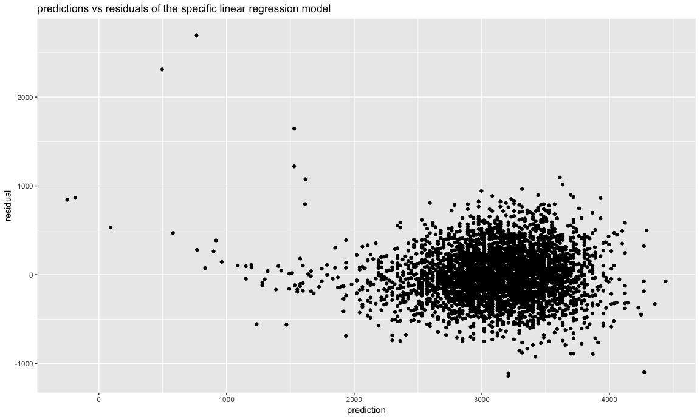

Homework6
================
Xinyao Wu
2018/11/16

``` r
knitr::opts_chunk$set(
  fig.width = 12,
  fig.asp = .6,
  out.width = "100%"
)
```

problem1
--------

**Washington Post**

#### Create a city\_state variable (e.g. “Baltimore, MD”), and a binary variable indicating whether the homicide is solved. Omit cities Dallas, TX; Phoenix, AZ; and Kansas City, MO – these don’t report victim race. Also omit Tulsa, AL – this is a data entry mistake. Modifiy victim\_race to have categories white and non-white, with white as the reference category. Be sure that victim\_age is numeric.

``` r
Original_data = read.csv("https://raw.githubusercontent.com/washingtonpost/data-homicides/master/homicide-data.csv") 
wp_df = 
  Original_data %>% 
  janitor::clean_names() %>% 
  #Create a city_state variable and a binary variable indicating whether the homicide is solved.
  mutate(
    city_state = str_c(city,state, sep = ", "), 
    resolved = as.numeric(disposition == "Closed by arrest")
  ) %>% 
  #Omit cities Dallas, TX; Phoenix, AZ; and Kansas City, MO
  filter(
    city_state != "Dallas, TX" & city_state !="Phoenix, AZ" & city_state !="Kansas City, MO" & city_state !="Tulsa, AL"
  ) %>% 
  mutate(
    victim_race = ifelse(victim_race =="White","white","non_white"),
    victim_race = fct_relevel(victim_race, "white"),
    victim_age = as.numeric(victim_age)
  )
wp_df %>% head(5) 
```

    ##          uid reported_date victim_last victim_first victim_race victim_age
    ## 1 Alb-000001      20100504      GARCIA         JUAN   non_white         79
    ## 2 Alb-000002      20100216     MONTOYA      CAMERON   non_white         12
    ## 3 Alb-000003      20100601 SATTERFIELD      VIVIANA       white         10
    ## 4 Alb-000004      20100101    MENDIOLA       CARLOS   non_white         29
    ## 5 Alb-000005      20100102        MULA       VIVIAN       white         73
    ##   victim_sex        city state      lat       lon           disposition
    ## 1       Male Albuquerque    NM 35.09579 -106.5386 Closed without arrest
    ## 2       Male Albuquerque    NM 35.05681 -106.7153      Closed by arrest
    ## 3     Female Albuquerque    NM 35.08609 -106.6956 Closed without arrest
    ## 4       Male Albuquerque    NM 35.07849 -106.5561      Closed by arrest
    ## 5     Female Albuquerque    NM 35.13036 -106.5810 Closed without arrest
    ##        city_state resolved
    ## 1 Albuquerque, NM        0
    ## 2 Albuquerque, NM        1
    ## 3 Albuquerque, NM        0
    ## 4 Albuquerque, NM        1
    ## 5 Albuquerque, NM        0

#### For the city of Baltimore, MD, use the glm function to fit a logistic regression with resolved vs unresolved as the outcome and victim age, sex and race (as just defined) as predictors.

**Save the output of glm as an R object; ** apply the broom::tidy to this object; and **obtain the estimate and confidence interval of the adjusted odds ratio for solving homicides comparing non-white victims to white victims keeping all other variables fixed.**

``` r
#For the city of Baltimore, MD
baltimore = wp_df %>% 
  filter(city_state =="Baltimore, MD") 
#fit a logistic regression
fit_baltimore = glm(resolved ~ victim_age + victim_sex + victim_race , family = binomial(), data = baltimore)

broom::tidy(fit_baltimore)
```

    ## # A tibble: 4 x 5
    ##   term                 estimate std.error statistic  p.value
    ##   <chr>                   <dbl>     <dbl>     <dbl>    <dbl>
    ## 1 (Intercept)           1.05      0.227        4.62 3.78e- 6
    ## 2 victim_age           -0.00374   0.00303     -1.23 2.17e- 1
    ## 3 victim_sexMale       -0.885     0.136       -6.50 8.08e-11
    ## 4 victim_racenon_white -0.793     0.174       -4.55 5.33e- 6

``` r
#the estimate of the adjusted odds ratio for solving homicides comparing non-white victims to white victims
coef(fit_baltimore)["victim_racenon_white"] %>% exp()
```

    ## victim_racenon_white 
    ##            0.4525206

``` r
#the confidence interval of the adjusted odds ratio for solving homicides comparing non-white victims to white victims
confint(fit_baltimore,"victim_racenon_white")%>% exp()
```

    ## Waiting for profiling to be done...

    ##     2.5 %    97.5 % 
    ## 0.3208675 0.6359593

#### Now run glm for each of the cities in your dataset, and extract the adjusted odds ratio (and CI) for solving homicides comparing non-white victims to white victims.

Do this within a “tidy” pipeline, making use of purrr::map, list columns, and unnest as necessary to create a dataframe with estimated ORs and CIs for each city.

``` r
 city_glm =
  wp_df %>% 
  select(resolved, city_state, victim_race,victim_age,victim_sex) %>% 
  group_by(city_state) %>% 
  nest() %>% 
  mutate(
    model = map(data,~glm(resolved ~ victim_age + victim_sex + victim_race ,family = binomial(),data = .)),
    model = map(model, ~broom::tidy(.,conf.int = TRUE))
)  %>% 
   select(-data) %>% 
  unnest() %>% 
  filter(term == "victim_racenon_white")  %>% 
  mutate(OR = exp(estimate),
         CI.low = exp(conf.low),
         CI.high = exp(conf.high)) %>% 
  select(city_state,OR,CI.low ,CI.high ) 

city_glm
```

    ## # A tibble: 47 x 4
    ##    city_state         OR CI.low CI.high
    ##    <chr>           <dbl>  <dbl>   <dbl>
    ##  1 Albuquerque, NM 0.686 0.416    1.12 
    ##  2 Atlanta, GA     0.767 0.433    1.32 
    ##  3 Baltimore, MD   0.453 0.321    0.636
    ##  4 Baton Rouge, LA 0.656 0.299    1.38 
    ##  5 Birmingham, AL  1.05  0.619    1.76 
    ##  6 Boston, MA      0.121 0.0447   0.272
    ##  7 Buffalo, NY     0.447 0.243    0.811
    ##  8 Charlotte, NC   0.555 0.318    0.931
    ##  9 Chicago, IL     0.575 0.442    0.751
    ## 10 Cincinnati, OH  0.327 0.186    0.554
    ## # ... with 37 more rows

#### Create a plot that shows the estimated ORs and CIs for each city. Organize cities according to estimated OR, and comment on the plot.

``` r
city_glm %>% 
  mutate(
    city_state = reorder(city_state,desc(OR))
  ) %>% 
ggplot(aes(x = city_state, y = OR))+ geom_line()+
  geom_errorbar(aes(x= city_state,ymin = CI.low, ymax = CI.high))+
  labs(
    y = "Odd ratio ",
    title = "odd ratio of homocides solving comparing non-white to white victims in United States"
  )+
  theme(
    axis.text.x = element_text(angle = 90 , hjust = 1)
  )
```

    ## geom_path: Each group consists of only one observation. Do you need to
    ## adjust the group aesthetic?


Comment:
--------

problem2
--------

Load and clean the data for regression analysis (i.e. convert numeric to factor where appropriate, check for missing data, etc.).

``` r
orignal_bw = read.csv("./data/birthweight.csv")
bw_df = orignal_bw %>% 
  janitor::clean_names() %>% 
  #convert numeric to factor where appropriate
  mutate(
    babysex = as.factor(ifelse(babysex==1,"male","female")),
    frace = as.factor(frace),
    malform = as.factor(malform),
    mrace = as.factor(mrace),
  )
#check for missing data
table(is.na(bw_df))
```

    ## 
    ## FALSE 
    ## 86840

Propose a regression model for birthweight. This model may be based on a hypothesized structure for the factors that underly birthweight, on a data-driven model-building process, or a combination of the two. **Describe your modeling process** and show a plot of model residuals against fitted values – use add\_predictions and add\_residuals in making this plot.

``` r
reg = bw_df %>% 
 select(bwt,babysex, bhead, blength) 
#the distribution of baby’s birth weight
ggplot(reg,aes(x = bwt))+geom_histogram()
```

    ## `stat_bin()` using `bins = 30`. Pick better value with `binwidth`.


``` r
#likely normal
#make a linear regression
  fit_self = lm(bwt~babysex + bhead + blength , data = reg)
  summary(fit_self)
```

    ## 
    ## Call:
    ## lm(formula = bwt ~ babysex + bhead + blength, data = reg)
    ## 
    ## Residuals:
    ##      Min       1Q   Median       3Q      Max 
    ## -1138.45  -190.36   -11.59   177.64  2693.95 
    ## 
    ## Coefficients:
    ##              Estimate Std. Error t value Pr(>|t|)    
    ## (Intercept) -6080.305     96.224 -63.189  < 2e-16 ***
    ## babysexmale   -41.086      8.887  -4.623 3.89e-06 ***
    ## bhead         148.175      3.512  42.192  < 2e-16 ***
    ## blength        85.016      2.071  41.044  < 2e-16 ***
    ## ---
    ## Signif. codes:  0 '***' 0.001 '**' 0.01 '*' 0.05 '.' 0.1 ' ' 1
    ## 
    ## Residual standard error: 288.5 on 4338 degrees of freedom
    ## Multiple R-squared:  0.6829, Adjusted R-squared:  0.6827 
    ## F-statistic:  3114 on 3 and 4338 DF,  p-value: < 2.2e-16

``` r
 pred_resid = modelr::add_predictions(reg, fit_self) 
 pred_resid$resid = modelr::add_residuals(reg, fit_self) %>% pull(resid)
 
  ggplot(pred_resid,aes(x = pred, y = resid))+
  geom_point()+
    labs(
      title = "predictions vs residuals of the specific linear regression model",
      y = "residual",
      x = "prediction"
    )
```



comments
--------

lm(bwt ~ babysex + bhead + blength + mrace + parity)

Compare your model to two others:
---------------------------------

One using length at birth and gestational age as predictors (main effects only) One using head circumference, length, sex, and all interactions (including the three-way interaction) between these Make this comparison in terms of the cross-validated prediction error; use crossv\_mc and functions in purrr as appropriate.
